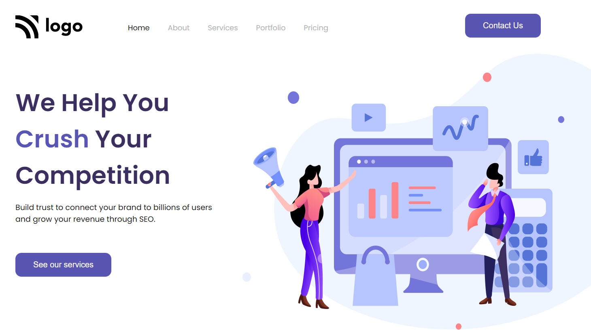
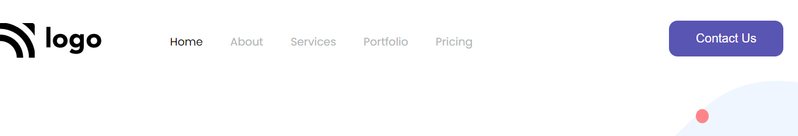

# PROJECT NO. 4

This is my Fourth  project of Web Development. In this project I have learnt concepts like targeting specific part of heading etc. 
> [Click here for deployed link](https://project-4-by-noman.netlify.app/)

FULL WEBPAGE:

NAVBAR:

BODY:

## Technologies Used

## What I leaned

- How to work with positions in CSS.
- Margin and Padding in CSS.
- Hovering effects in CSS.
- Displaying Images properly.
- Targeting specific element in a heading.

# Connect with me

   &ensp;
  &ensp;
  &ensp;
  
